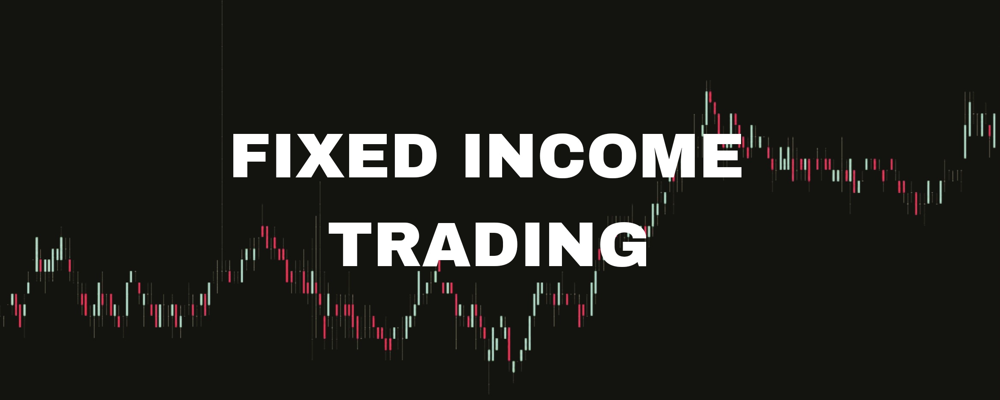
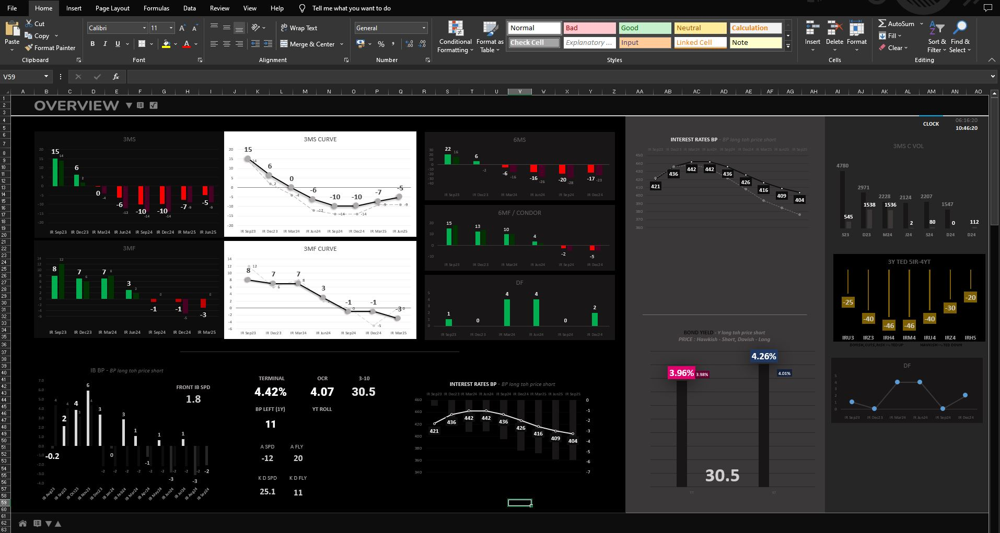
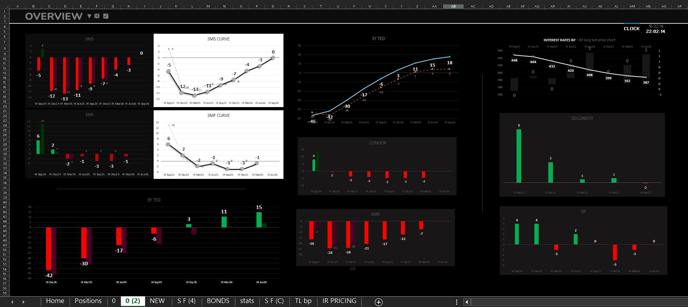
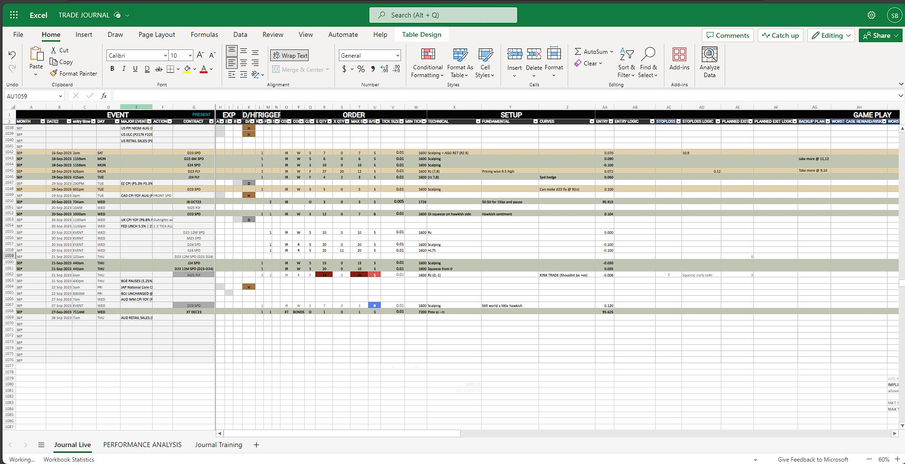
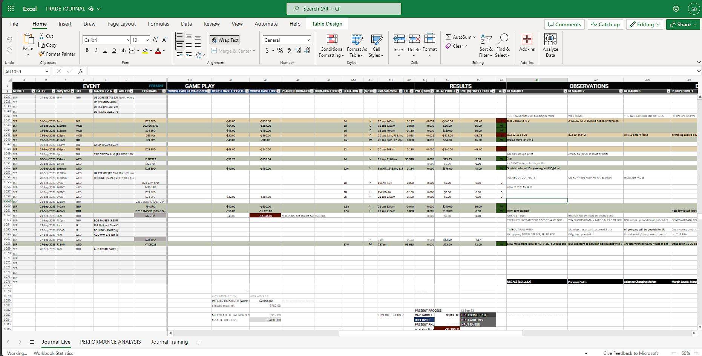
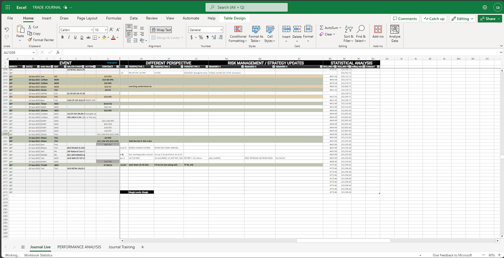
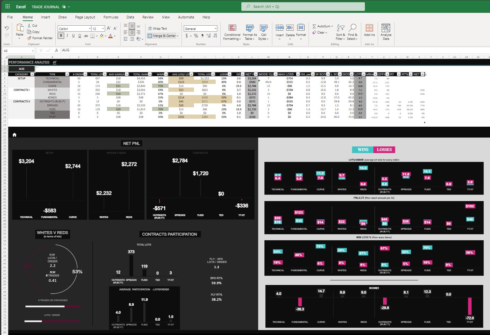
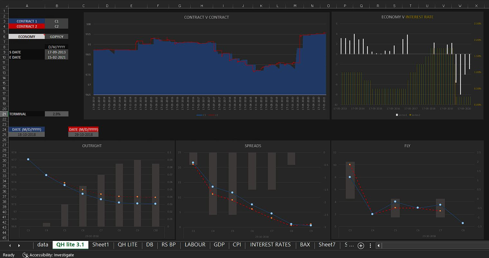

 
 
 

### OVERVIEW DASHBOARD OF AUSTRALIAN FIXED INCOME MARKET 
*Displaying STIR curves: 30-day Interbank Cash Rate Futures, 90-day accepted Bill Futures, their spreads, flies, de-flies, combinations, and 3-year, and 10-year bonds in bar and line charts with other useful metrics*
  

   

  
### TRADE JOURNAL 
*Maintaining a journal for events, trade setup, risk management, PnL, observations, perceptions, and strategy updates* 
  

  

### PERFORMANCE ANALYSIS DASHBOARD 
*Analyzing Net PnL for different setups and contracts, participation, lot sizing, score metrics, and characteristics of wins and losses* 
  

  
### SCENARIO ANALYSIS 
*Analyzing case scenarios for front contracts, getting insights of meeting impacts, ranges, curve movements, and risk-reward ratio* 
  

  
### MACROECONOMIC ANALYSIS DASHBOARD 

  
