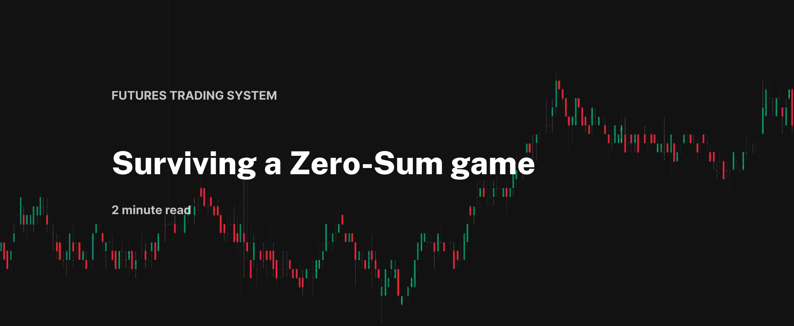

 

# LIVE EXCEL DASHBOARDS
### OVERVIEW DASHBOARD - Keeping an eagle eye on Australian Fixed Income market

 
*STIR: 30-day Interbank Cash Rate Futures, 90-day accepted Bill Futures, their spreads, flies, de-flies, condors, other combinations.*  
*BONDS: 3-year bond, 10-year bond, yield curve*
  

### RISK SCENARIO ANALYSIS - Look at the range of outcomes and be prepapred for it 

 
*Case scenarios for front contracts | Meeting impacts on contracts | Contract ranges | Curve movement | Risk-reward ratio* 
  

### PERFORMANCE ANALYSIS DASHBOARD - How was the performance? 

 
*Analyzing different setups and contracts | Net PnL, Participation and Lot sizing  
Wins vs Losses | Viewing wins & losses objectively* 
  

### AUTOMATED TRACKING FI METRICS 

*Automating recording important fixed income metrics around volatile events using Excel Macros*  
  

# BASIC QUANTITATIVE ANALYSIS 
### Statistical Analysis | Value at Risk (VaR) 
#### [View  Python code](https://github.com/s1dewalker/Futures-trading/blob/main/Stats.ipynb)
### Correlation & Seasonality
#### [View  Python code](https://github.com/s1dewalker/Futures-trading/blob/main/Quantitative-Analysis-(QA)/correlation.ipynb)
### ML for market states (k-means clustering)
#### [Show model in Python](https://github.com/s1dewalker/Futures-trading/blob/main/Quantitative-Analysis-(QA)/qtnb1-states.ipynb)
### Simple Markov Model
#### [Show Model in Python](https://github.com/s1dewalker/Futures-trading/blob/main/Quantitative-Analysis-(QA)/MARKOV_MODEL.ipynb)

 

### Trade Journal 

*Maintaining a journal for events, trade setup, risk management, worse case losses, PnL, observations, perceptions, and strategy updates*  
*[View Trade Journal Analysis in Python](https://github.com/s1dewalker/Airbnb-listings-NYC/blob/main/Airbnb%20correlation.ipynb](https://github.com/s1dewalker/Futures-trading/blob/main/trade_journal_analysis/tja.ipynb))*  

  
# ACCOUNT MANAGEMENT / BUDGETING 
*Balance sheet was mostly conservative*

- #### Lot sizing

- #### Allocation

   

# RESULTS

