 
"There is one attribute that stands out above all: **consistency**"  
 It's a process.  

# **DATA ANALYTICS W/ EXCEL**
### LIVE OVERVIEW DASHBOARD - Keeping an Eagle Eye on Australian Fixed Income market

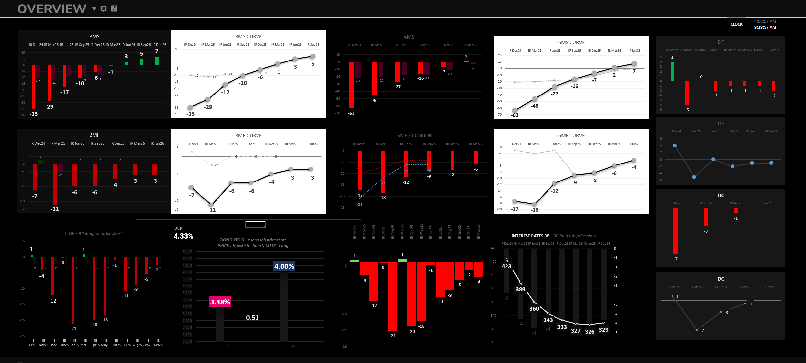
 
*STIR: 30-day Interbank Cash Rate Futures, 90-day accepted Bill Futures, their spreads, flies, de-flies, condors, other combinations and curve structures.*  
*BONDS: 3-year bond, 10-year bond, yield curve.*  
*Creating this dashboard helped to view the entire Australian Fixed Income futures market in one screen.*
  

### RISK SCENARIO ANALYSIS - Look at the Range of Outcomes and Be Prepared for it 

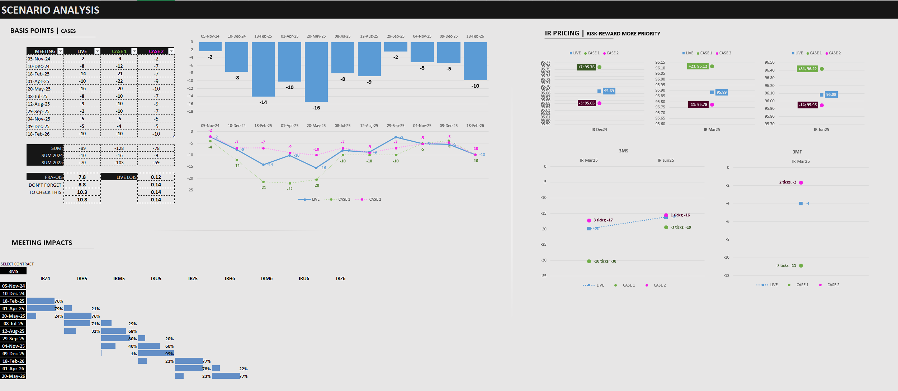
 
*Case scenarios for front contracts | Meeting impacts on contracts | Contract ranges | Curve movement | Risk-reward ratio*  

*This helped to input basis point expectations for each RBA meeting and check the pricing for different cases, which gave ranges, risk-reward for contracts and combinations. Bottom left side had meeting impact section, which showed meeting impacts on the selected contract or strategy.*   *This showed which trades not to take, more than, which trades to take.*  

*"Sometimes, not taking a trade is a trade itself."*
  

### PERFORMANCE ANALYSIS - Changing the Game with Metrics and Stats
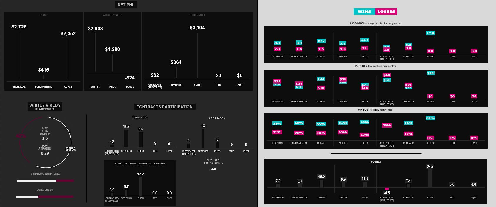
 
*Analyzing different setups and contracts | Net PnL, Participation and Lot sizing  
Wins vs Losses | Viewing wins & losses objectively*  

*Separating wins and losses helped check the nature of trading strategies objectively. This helped to be defensive on losing (or, not so profitable) strategies and push on the better ones, improving consistency.*
 

*Consistency is not just about making profitable trades every single time. It is about growing a discipline approach to trading that generates reliable results over a long period of time.*  

*__Consistency focus:__*  

- *Market analysts focused on consistency prioritize the reliability and stability of their performance over time. They aim to generate steady returns while minimizing the impact of losses and market volatility.*
- *While consistency focused analysts may not always achieve the highest returns on individual transactions, they aim to maintain a steady and reliable track record of profitability. In turn such an approach can lead to more predictable and manageable outcomes over the long term.*

 

### AUTOMATED TRACKING FI METRICS 

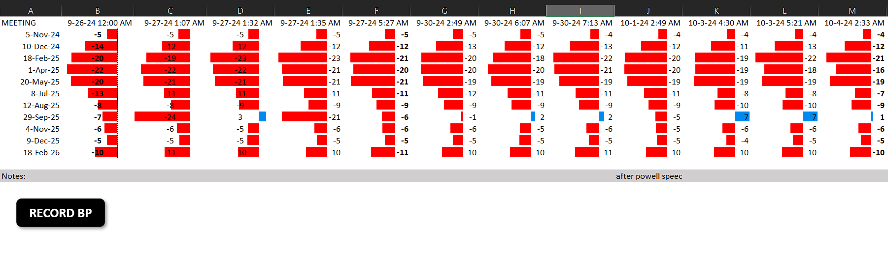

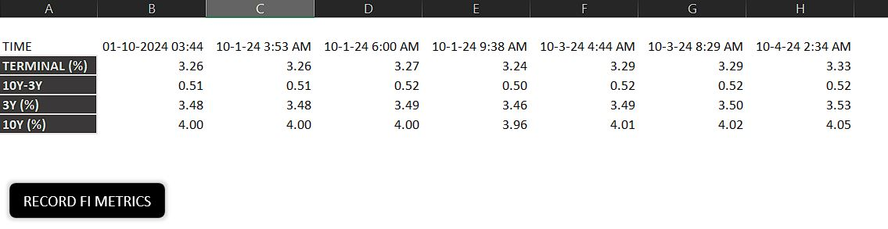

*Automated recording metrics like expectations for the next 10 RBA meetings, yield curve, terminal rate, around volatile events using Excel Macros.*  
  

# QUANTITATIVE ANALYSIS (QA) & MODELS 
### Statistical Analysis | Value at Risk (VaR) 

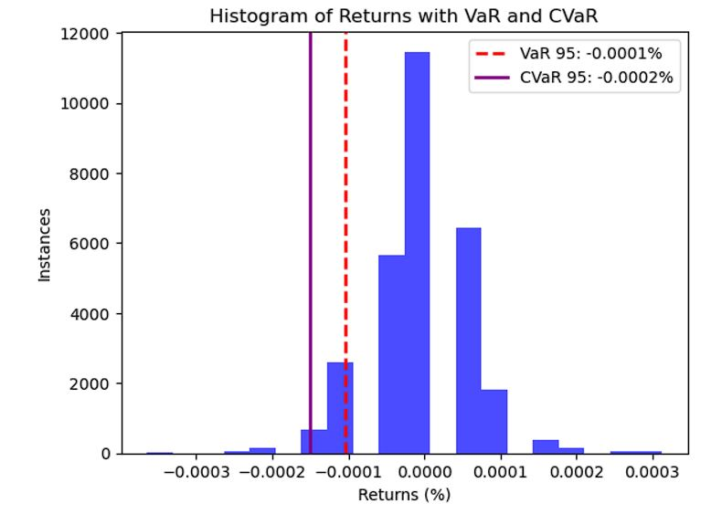 

#### [View Python code for statistical analysis](https://github.com/s1dewalker/Futures-trading/blob/main/Stats.ipynb)  

### Random Walk Simulation for Simulation VaR

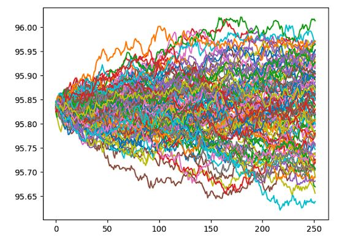 

#### [View Monte Carlo Simulation](https://github.com/s1dewalker/Futures-trading/blob/main/Quantitative-Analysis-(QA)/A_random_walk_simulation.ipynb)

### Correlation
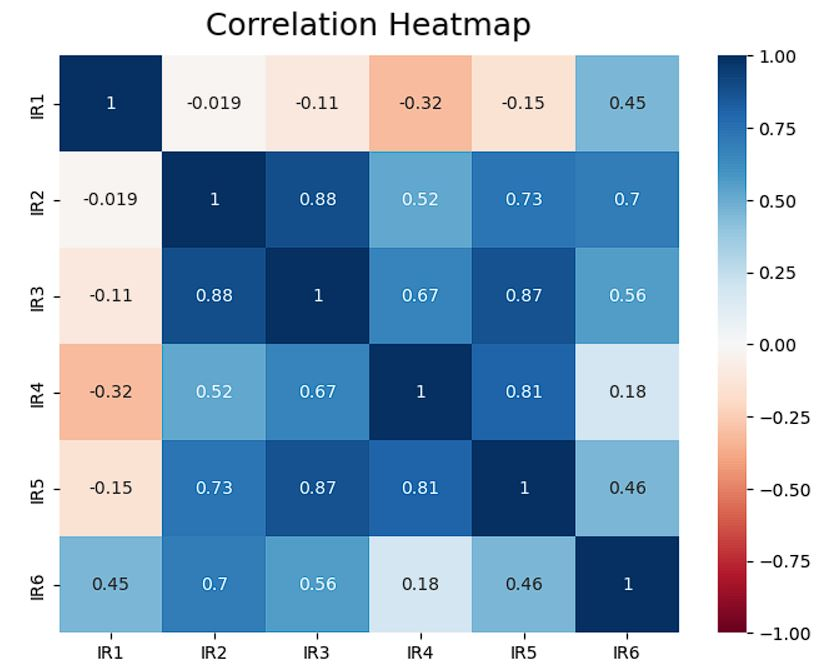

### Machine Learning (k-means clustering) to find market states 
#### [Finding states w/ clustering in Python](https://github.com/s1dewalker/Futures-trading/blob/main/Quantitative-Analysis-(QA)/qtnb3-states.ipynb)

Steps:  
1. Data preparation: cleaning, transformation  
2. Create features: like high-low, hl/volume, 5 day rolling volatility, etc and get them in a separate dataframe "X"
3. Normalize "X" (as some features might dominate due to larger scale): use `MinMaxScaler` function
4. Find market states w/ k-means clustering: find best "k" with WCSS method with `inertia_`. Fit the model with `KMeans`. Predict clusters with `.fit_predict` on "X".

### Simple Markov Model to predict market states

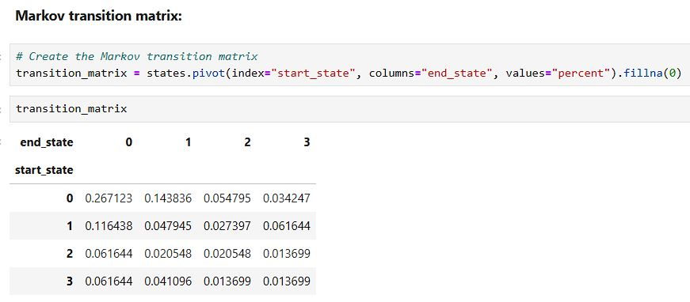

*Applications:*  
- *Prediction: Predict the next state of the market based on the current state (i.e., forecasting the market's behavior).*
- *Optimization: Use the Markov Model for portfolio optimization, where states represent different market conditions, and transitions model how the market shifts.*
- *Risk Assessment: Assess the risk of being in a certain state at a future time.*

#### [View Model in Python](https://github.com/s1dewalker/Futures-trading/blob/main/Quantitative-Analysis-(QA)/MARKOV_MODEL_2.ipynb)

 

### Trade Journal 

*Maintaining a journal for events, trade setup, risk management, worst case losses, PnL, observations, perceptions, and strategy updates.*  
***Knowing the risks before taking them.***  
*[View Trade Journal Analysis in Python](https://github.com/s1dewalker/Airbnb-listings-NYC/blob/main/Airbnb%20correlation.ipynb](https://github.com/s1dewalker/Futures-trading/blob/main/trade_journal_analysis/tja.ipynb))*  

  
# RESILIENT AND DEFENSIVE ACCOUNT MANAGEMENT SYSTEM 
*Balance sheet was mostly Conservative and Risk Averse.*

- #### Lot sizing
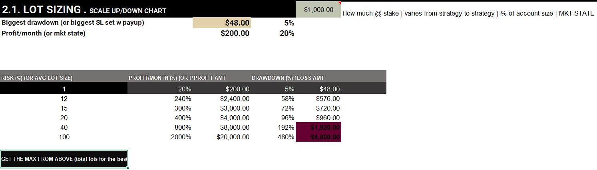

- #### Allocation
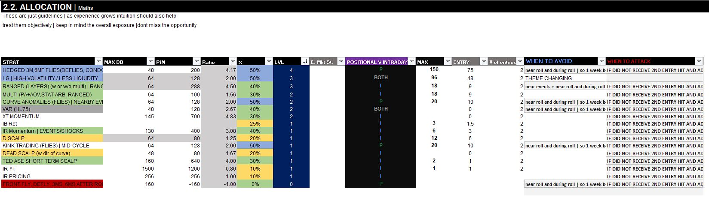

   

# RESULTS
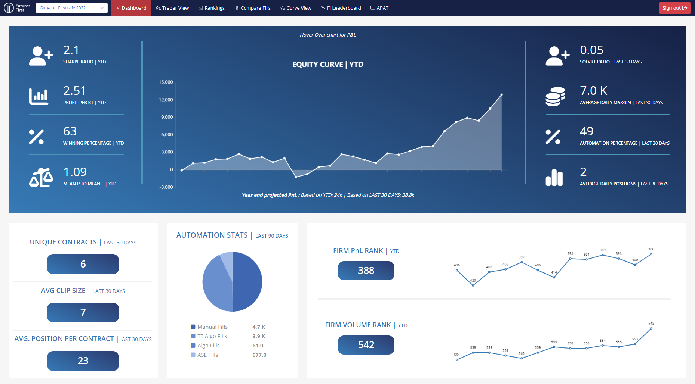

  

*hope you find it helpful, and encourage you to forward any suggestions for improvements*  
##### [LinkedIn](https://www.linkedin.com/in/sujay-bhaumik-d12/) | s1dewalker23@gmail.com | [Discussions](https://github.com/s1dewalker/Futures-trading/discussions/1) | [Research Works](https://github.com/s1dewalker/Research-Works)
