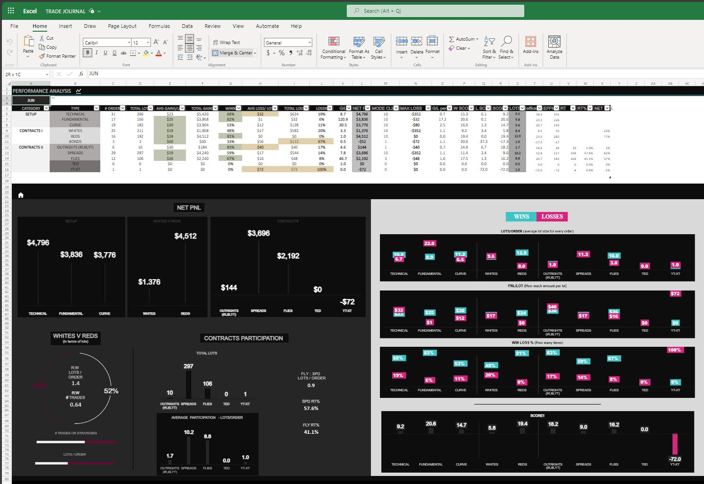

 
 
 

### OVERVIEW DASHBOARD OF AUSTRALIAN FIXED INCOME MARKET 
*Displaying STIR curves: 3 and 6-month spreads, flies, de-flies, combinations, and bonds in bar and line charts with other useful metrics*
  

  
### TRADE JOURNAL 

  

### PERFORMANCE ANALYSIS 

  
### MACROECONOMIC ANALYSIS 

  
